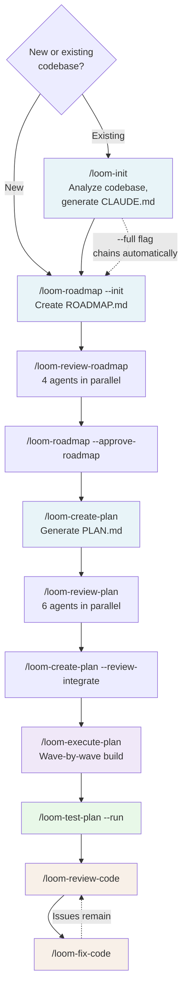
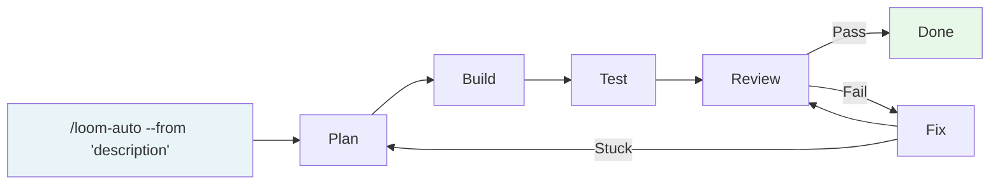
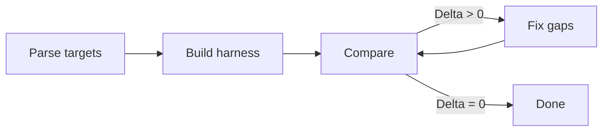

# Loom

A multi-agent pipeline for planning, executing, testing, and reviewing software projects with Claude Code.

## What It Does

Fifteen slash commands that compose 40+ specialized agents:

| Command | What it does |
|---------|-------------|
| `/loom-init` | Brownfield onboarding: analyze codebase, generate CLAUDE.md + CONTEXT.md |
| `/loom-roadmap` | Roadmap creation, milestone tracking, dependency graphs, versioning |
| `/loom-review-roadmap` | 4 agents review a ROADMAP.md in parallel |
| `/loom-create-plan` | Generate PLAN.md (v2 spec) from approved ROADMAP.md |
| `/loom-review-plan` | 6 agents analyze a PLAN.md in parallel |
| `/loom-execute-plan` | Wave-by-wave execution with contracts, parallel implementers, wiring, and verification |
| `/loom-test-plan` | Acceptance criteria extraction + unit + E2E test generation |
| `/loom-review-code` | 9 reviewers (6 built-in + 3 bespoke) with severity-ranked output |
| `/loom-fix-code` | Auto-apply review findings with parallel fixer-agents and verification |
| `/loom-converge` | Convergence loop: compare implementation against deterministic targets |
| `/loom-auto` | Fully autonomous pipeline with feedback loops |
| `/loom-note` | Accumulate development notes, review and assimilate into docs |
| `/loom-create-agent` | Interactive wizard to create project-specific bespoke agents |
| `/loom-library` | Pull-on-demand catalog management: install, sync, search, update |
| `/loom` | Full reference |

## Install

**Bootstrap** (first time):
```bash
gh repo clone launchstack-dev/loom-ai
# or: git clone https://github.com/launchstack-dev/loom-ai.git
cd loom-ai
./install.sh
```

This one-time bootstrap copies the catalog and `/loom-library` command into `~/.claude/`. After that, **all management is pull-on-demand** via `/loom-library` — no symlinks, no manual file copying.

**Per-project setup:**
```
/loom-library use loom-init          — install the onboarding command + its agent deps
/loom-library use loom-execute-plan  — install execution pipeline + contracts, implementer, wiring, verification agents
/loom-library use loom-auto          — install everything (pulls all commands + agents transitively)
```

**Ongoing management:**
```
/loom-library list           — see what's installed vs available
/loom-library sync           — re-pull all installed items, detect source changes
/loom-library update         — check for new catalog entries + changed items
/loom-library search <query> — find items by name or description
/loom-library remove <name>  — uninstall (warns about dependents)
```

`/loom-library` resolves dependencies automatically, tracks content hashes for drift detection, and supports both local and GitHub sources. Run `/loom` in Claude Code to verify.

## Architecture

```
Commands (user-facing)              Agents (spawned by commands)
──────────────────────              ───────────────────────────
/loom-init ───────────────────────→ project-guidance + api-explorer + docs-auditor
/loom-roadmap ────────────────────→ questioner → roadmap-builder → plan-builder
/loom-review-roadmap ─────────────→ 4 review agents (parallel)
/loom-review-plan ────────────────→ 6 planning agents (parallel)
/loom-execute-plan ───────────────→ contracts → implementers → wiring → verification
/loom-test-plan ──────────────────→ criteria → unit-test → e2e-test
/loom-review-code ────────────────→ 6 built-in + 3 bespoke reviewers
/loom-fix-code ───────────────────→ parallel fixer-agents
/loom-converge ───────────────────→ target-parser → harness → delta-analyzer → driver
/loom-auto ──────────────────────→ chains all commands with automated gates

Protocols (shared contracts)
────────────────────────────
agent-result.schema.md        ← Standard return envelope
state.schema.md               ← Execution state for resume
pipeline-state.schema.md      ← Autonomous pipeline state
execution-conventions.md      ← File ownership, context tiers, TOON format
toon-format.md                ← TOON format specification
orchestration-config.schema.md ← Per-project agent registration
orchestration-patterns.md     ← Debate, chain, vote, triage, converge patterns
validation-rules.md           ← Output validation, blocker gates, plan validation
plan.schema.md                ← PLAN.md format specification
roadmap.schema.md             ← ROADMAP.md format specification
spec.schema.md                ← v2 spec sections (API specs, state machines)
agent-monitoring.schema.md    ← Progress reporting, stale detection, dashboards
pattern-executor.md           ��� Pattern runtime (debate, chain, vote, triage, converge)
```

## Workflows

Pick the workflow that matches your situation:

### Full pipeline

The default path — maximum control at every stage.



**Brownfield** (existing codebase):
```
/loom-init                              Analyze codebase, generate CLAUDE.md + CONTEXT.md
/loom-roadmap --init --brownfield       Create roadmap informed by existing code
/loom-review-roadmap                    4 agents review the roadmap
/loom-roadmap --approve-roadmap         Lock roadmap
/loom-create-plan                       Generate PLAN.md from approved roadmap
/loom-review-plan                       6 agents analyze plan in parallel
/loom-create-plan --review-integrate    Apply plan review findings
/loom-execute-plan                      Wave-by-wave build
/loom-test-plan --run                   Generate and run tests
/loom-review-code                       Full code review
/loom-fix-code                          Auto-apply findings
```

**Greenfield** (new project) — same pipeline, skip `/loom-init`:
```
/loom-roadmap --init --from "description"
```

### Autonomous

One command runs the full pipeline with automated gates and feedback loops.



```
/loom-auto --from "add user authentication with OAuth"
```

Circuit breakers stop the loop if fixes stall or iterations exceed the budget. Escalates to you with a report of what worked and what didn't.

### Quick brownfield onboard

Analyze an existing codebase and chain directly into roadmap creation:

```
/loom-init --full --from "add team management"
```

### Convergence (deterministic targets)

When you have a spec, migration, or reference implementation to match exactly:



```
/loom-converge --targets spec.json --source src/
```

## Agent Groups

| Group | Agents | Used by |
|-------|--------|---------|
| **Onboarding** | project-guidance, api-explorer, docs-auditor | `/loom-init` |
| **Strategy & UX** | strategy-agent, ux-agent | `/loom-review-plan`, `/loom-review-roadmap`, `/loom-review-code` |
| **Roadmap** | roadmap-builder, scope-feasibility, questioner | `/loom-roadmap --init` |
| **Planning** | feature-coverage, phasing, parallelization, agentic-workflow, plan-builder | `/loom-review-plan`, `/loom-create-plan` |
| **Execution** | contracts, implementer, api-route-creator, api-connector, wiring, verification | `/loom-execute-plan` |
| **Testing** | acceptance-criteria, unit-test, e2e-test | `/loom-test-plan` |
| **Code Review** | security, architecture, plan-compliance + 6 built-in reviewers | `/loom-review-code` |
| **Extended Review** | performance, accessibility, dependency-auditor, api-design, database-schema, infra, observability | `/loom-review-code --full` |
| **Convergence** | target-parser, harness-builder, delta-analyzer, convergence-driver | `/loom-converge` |
| **Architecture** | tech-stack-debater, migration-architect | debate/chain patterns |
| **Documentation** | docs-generator, docs-auditor, project-guidance | `/loom-init`, docs workflows |
| **Utility** | meta-agent, tdd-coach, fixer-agent | `/loom-create-agent`, `/loom-fix-code` |

## Per-Project Extensibility

Create `.claude/orchestration.toml` in any project to add custom agents:

```toml
[review.agents.hipaa-reviewer]
source = ".claude/agents/hipaa-reviewer.md"
model = "sonnet"
modes = ["default", "full"]
outputRole = "reviewer"

[execution.agents.migration-agent]
source = ".claude/agents/migration-agent.md"
model = "opus"
phase = "post-contracts"
outputRole = "producer"
```

Or use `/loom-create-agent` to interactively create an agent and wire it into a pipeline.

## Orchestration Patterns

Beyond fan-out and pipeline, configure advanced patterns in `orchestration.toml`:

- **Debate** — adversarial multi-round reasoning for architecture decisions
- **Chain** — progressive refinement (draft → refine → harden)
- **Vote** — parallel independent solutions + evaluator picks best
- **Triage** — cheap router classifies tasks, routes to appropriate specialist
- **Converge** — iterative comparison against deterministic targets until delta reaches zero

## Data Formats

- **TOON** (Token-Oriented Object Notation) for all on-disk artifacts and agent communication — 30-60% token savings
- **JSON** for schema validation only (AJV test schemas)

## Hooks (Deterministic Enforcement)

Six Claude Code hooks in `hooks/` enforce critical invariants at the tool-call level:

| Hook | Event | What it does |
|------|-------|-------------|
| `file-ownership` | PreToolUse | Blocks writes outside agent's file ownership boundary |
| `contract-lock` | PreToolUse | Locks `contracts/` after Wave 0 |
| `budget-tracker` | PreToolUse + SubagentStop | Tracks agent count, blocks spawns at budget limit |
| `status-updater` | SubagentStop | Updates status.toon timestamps |
| `quality-gate` | Stop | Prevents premature pipeline stops |
| `typecheck-on-write` | PostToolUse | Runs tsc after TS writes, feeds errors back |

All hooks use a shared harness (`hooks/lib/run-hook.ts`) that adopts Hookify's defensive patterns: always exit 0 on errors, fail open on missing state, atomic stdin consumption. Registered in `.claude/settings.json`.

## Persistence

- `.plan-execution/` — ephemeral execution state (gitignored)
- `.plan-history/` — reviews, decisions, wave summaries, milestones (git-tracked)

## Tests

```bash
# Protocol tests
cd test/protocol && bun install && bunx vitest run

# Hook tests
cd hooks && bun install && bunx vitest run
```

117 tests validating the inter-agent protocol: schema validation (with TOON roundtrip fidelity), plan validation (structure, dependency cycles, critical path, file ownership, sizing, criteria quality), scope coverage (orphan detection, drift tracking), context compression, agent monitoring (graded E2E rubric), handoff chains, file ownership detection, and feedback logging.

## File Structure

```
agents/                     30+ agent definitions
  protocols/                 13 protocol specs
commands/                    13 slash commands
hooks/                       6 deterministic enforcement hooks
  lib/                       Shared harness + TOON reader + context resolver
  __tests__/                 Hook tests
.claude/settings.json        Hook registrations
skills/library.yaml          Library registry
test/protocol/               Protocol tests
test-fixtures/               Test plan fixtures (valid + broken)
install.sh                   Bootstrap installer (one-time)
```
